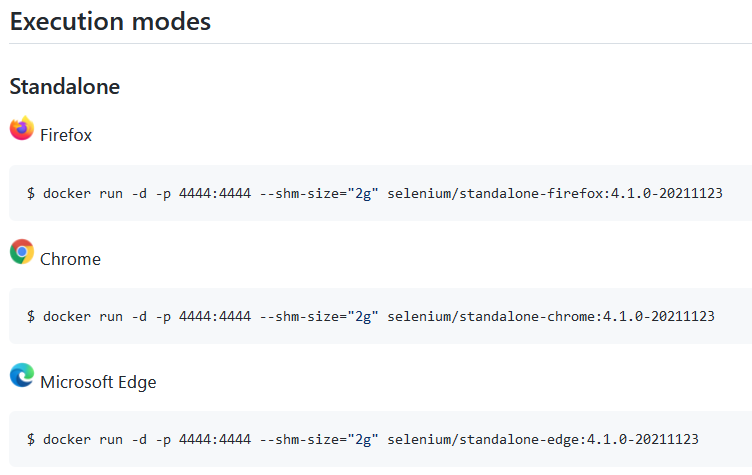
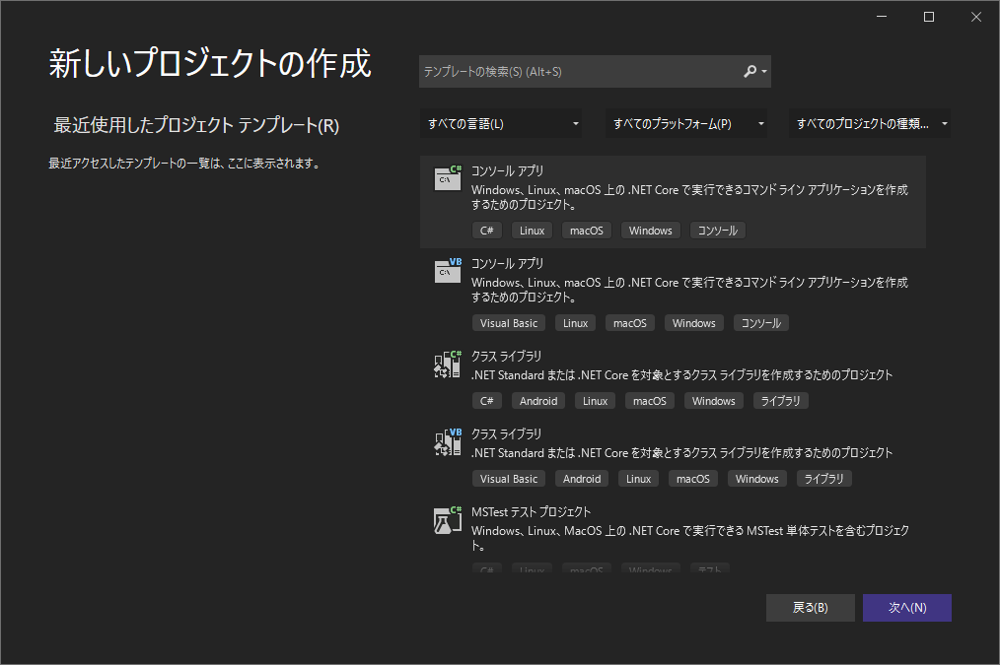
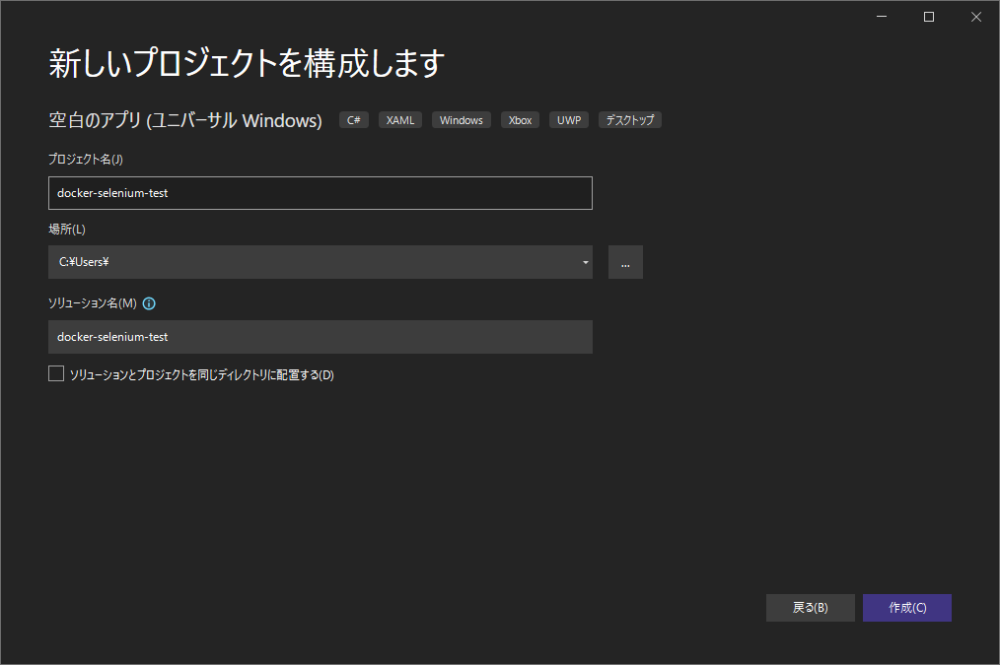
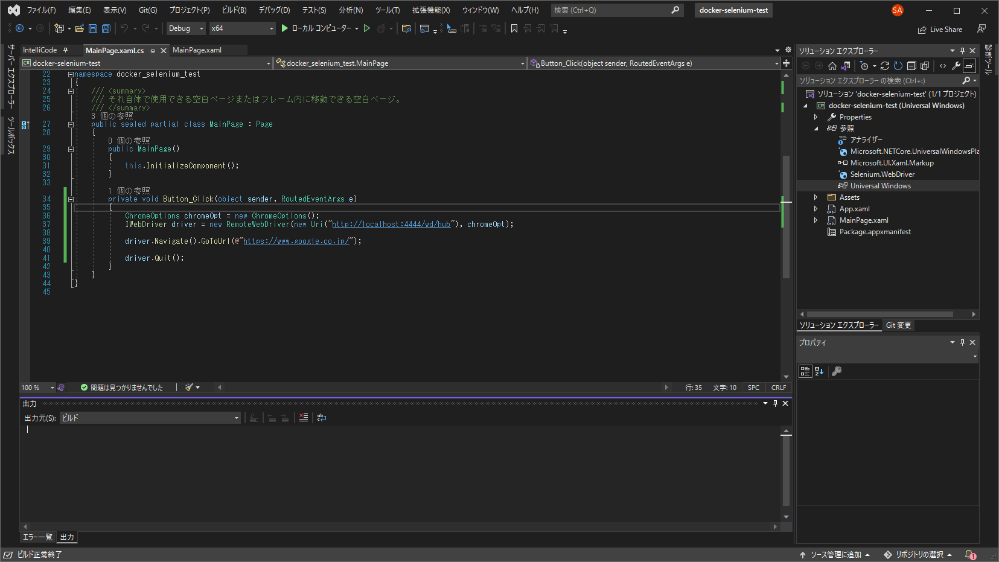

# docker-seleniumメモ書き

## Dockerインストール

省略

## docker-selenium chromeをインストール

Selenium公式の配布サイト  
https://github.com/SeleniumHQ/docker-selenium

以下画像の箇所からコマンドをコピペして実行する。  
とりあえずChrome用を実行。




開発時はVNCで接続できる以下の形のコマンドが便利。  
port=5900, password=secretで接続可能。  
`docker run -d -p 4444:4444 -p 5900:5900 --shm-size="2g" selenium/standalone-chrome:4.1.0-20211209`

## C#からdocker-seleniumを使う

最近正式リリースされた Visual Studio Community 2022 で適当に作成してみる。

プロジェクト作成





NuGetから以下ダウンロード

* Selenium.WebDriver

Docker上で動かしているので、Selenium操作はRemoteWebDriverを介して使うことになるが、DesiredCapabilitiesにアクセスできず最初は混乱した。  
こちらの情報が参考になった。  
https://qiita.com/kn2018/items/0f0f1de4a15a60301458


以下、最小コード。

```csharp:sample.cs
ChromeOptions chromeOpt = new ChromeOptions();
IWebDriver driver = new RemoteWebDriver(new Uri("http://localhost:4444/wd/hub"), chromeOpt);

driver.Navigate().GoToUrl(@"https://www.google.co.jp/");

driver.Quit();
```




.NET向けAPIリファレンス  
https://www.selenium.dev/selenium/docs/api/dotnet/index.html


## 自動操作のコード生成

自動操作のコード生成は、Selenium IDEなどを使うと楽。

こちらの情報が参考になった。  
https://freeheroblog.com/google-selenium-ide/

