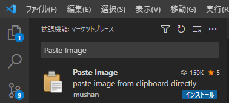
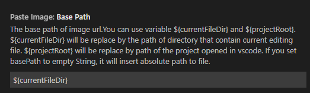
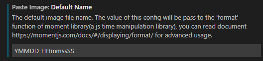
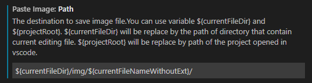

# Visual Studio Code メモ書き

## markdown プレビュー

Ctrl + k -> v

## markdownへの画像貼り付け

参考

> Past Image拡張機能が便利  
> https://marketplace.visualstudio.com/items?itemName=mushan.vscode-paste-image

### インストール方法

1. 拡張機能:マーケットプレースで"Paste Image"で検索しインストール  

### 設定（自分用）

1. Base Path -> `${currentFileDir}`  

1. Default Name -> `YMMDD-HHmmssSS`  

1. Path -> `${currentFileDir}/img/${currentFileNameWithoutExt}/`  

### 使い方

1. 使いたい画像をスクショ(Windows:Win+shift+s, Mac: Cmd+Shift+5)
1. 貼りたい場所にCtrl+Alt+V (MacならCmd+alt+V)
1. 設定したフォルダに画像が保存され、そのパスへの参照が挿入される
