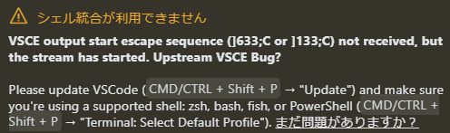

# Visual Studio Code メモ書き

## コマンドパレット

* ctrl + shift + p

## markdown プレビュー

Ctrl + k -> v

## markdownへの画像貼り付け

### 参考

Markdownでスクショ画像をペーストする(VS Code)  
https://zenn.dev/ktechb/articles/968ff79f8f9c46a26ee5

Marketplace  
https://marketplace.visualstudio.com/items?itemName=mushan.vscode-paste-image


### インストール方法

1. 拡張機能:マーケットプレースで"Paste Image"で検索しインストール  


### 設定（自分用）

1. Base Path -> `${currentFileDir}`  

1. Default Name -> `YMMDD-HHmmssSS`  

1. Path -> `${currentFileDir}/img/${currentFileNameWithoutExt}/`  


### 使い方

1. 使いたい画像をスクショ(Windows:Win+shift+s, Mac: Cmd+Shift+5)
1. 貼りたい場所にCtrl+Alt+V (MacならCmd+alt+V)
1. 設定したフォルダに画像が保存され、そのパスへの参照が挿入される

## settings.json

* コマンドパレットで `open setting json` から選択
* ユーザ
    * 左下の[歯車マーク] -> [設定] -> 右上のタイトルバー直下にあるアイコンから開ける
    * `%APPDATA%\Code\User\settings.json`
* ワークスペース
    * `<プロジェクトルート>/.vscode/settings.json`

## タイトルバーの色変更

* たぶんユーザの settings.json を変更するのが良い気がする
    * 以下追記
        ```json
            "workbench.colorCustomizations": {
            "titleBar.activeBackground": "#20538a",
            "titleBar.activeForeground": "#cccccc",
            // "activityBar.background": "#069194",
            // "activityBar.foreground": "#000000"
        }
        ```

## 特定ワークスペースのみテーマを変更する

* ワークスペースの settings.json を以下のように変更
    ```json
    {
        //略
        "workbench.colorTheme": "GitHub Dark",
        "workbench.layoutControl.enabled": false,
        //略
    }
    ```

## Cline/Roo-Code系とのターミナル統合

以下のようなエラーが出る場合、基本的には「まだ問題がありますか？」のリンク先に従えばOK。

* 
    > シェル統合が利用できません
    > VSCE output start escape sequence (]633;C or ]133;C) not received, but the stream has started. Upstream VSCE Bug?
    > 
    > Please update VSCode (CMD/CTRL + Shift + P → "Update") and make sure you're using a supported shell: zsh, bash, fish, or PowerShell (CMD/CTRL + Shift + P → "Terminal: Select Default Profile"). まだ問題がありますか？

ただし、以下のWARGNINGが出ている場合はうまくいかない。

> Warning: PowerShell detected that you might be using a screen reader and has disabled PSReadLine for compatibility purposes. If you want to re-enable it, run 'Import-Module PSReadLine'.

この場合 `code $Profile` で開いたファイルに以下を追記。

```
Import-Module PSReadLine
if ($env:TERM_PROGRAM -eq "vscode") { . "$(code --locate-shell-integration-path pwsh)" }
```
